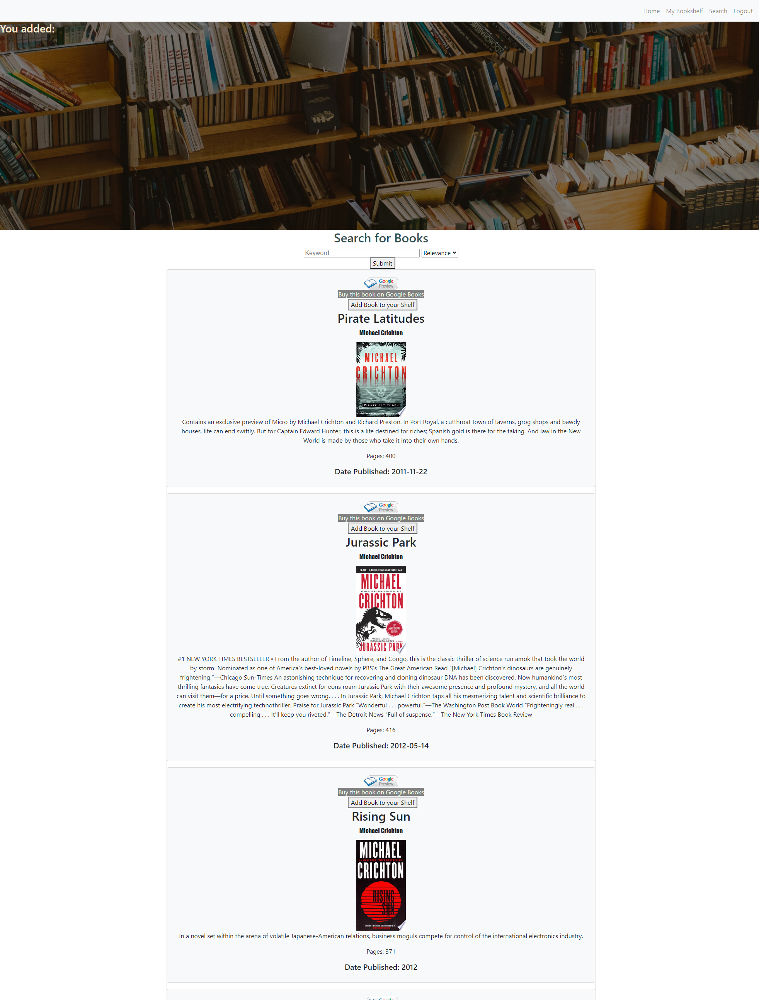

# WORM


## Description

WORM is a digital bookshelf application that allows users to search for books by entering a specific query (Title, Author, Exerpt, etc). The user submits the query, which then calls upon the Google Books API, returning an array of books with the corresponding data. The user will then see a list of books relating to the search query.



Users can then save their favorite books to their personal bookshelf library as well as delete them, view samples of the books if they are available, write their own comments or visit the google books link to buy the book for themselves. The Google Books API has an embedded sample reader button that shows *if one is available* for that particular book. Clicking on the icon will allow you to read a pre-selected portion of the book from within the app.


View the [Deployed Heroku App](https://gentle-sands-52914.herokuapp.com/)

## Table of Contents
* [Description](#description)
* [User Story](#userstory)
* [Installation](#installation)
* [Technology Used](#technologyused)
* [Credits](#credits)
* [License](#license)
* [Questions](#questions)

## User Story

The client is represented as a user who likes to read and likes to keep track of their favorite books. Users are prompted to create their own account and sign in using authorization of an email and password.

The client can use WORM's book search to find books they would like to read or keep track of. Books that meet the user's search criteria will be displayed upon searching.

Users can add books to their personal bookshelf library, which will be displayed in a separate page of the navigation bar. Users can also email their bookshelf to other users.

## Installation

To use WORM, install Node.js. In the terminal, run the following command: 

``` 
npm init -y 
```

Then, install the following dependencies:
```
npm install express to install express
npm install express-handlebars to install handlebars
npm install mysql to install mysql
npm install dotenv for the environment variable
npm install passport for authentication
npm install bcryptjs for authentication / password hashing
npm install sequelize for the sequelize databases
```

## Technology Used

* HTML/CSS
* Handlebars
* Node.js
* Express 
* MySQL 
* Sequelize
* Passport
* Bootstrap
* jQuery
* Heroku
* Jaws_DB addon for Heroku
* [Google Books API](https://developers.google.com/books)
* [NodeMailer](https://nodemailer.com/usage/) - feature not complete

## Credits

WORM was created by team members from UC Davis's Full Stack Coding Bootcamp: 

* [Pirooz Wallace](https://github.com/attack-theoRy)
* [Mike Derjabin](https://github.com/mikederjabin)
* [Alex Bachicha](https://github.com/alexbachicha)
* [Eli Derjabin](https://github.com/derjabineli)

## License 

Licensed under the [MIT License](LICENSE.txt)

## Questions

Any questions, inquries or requests can be directed to me at <agbachicha@outlook.com>

Check out my [GitHub](https://github.com/alexbachicha) and give me a follow

