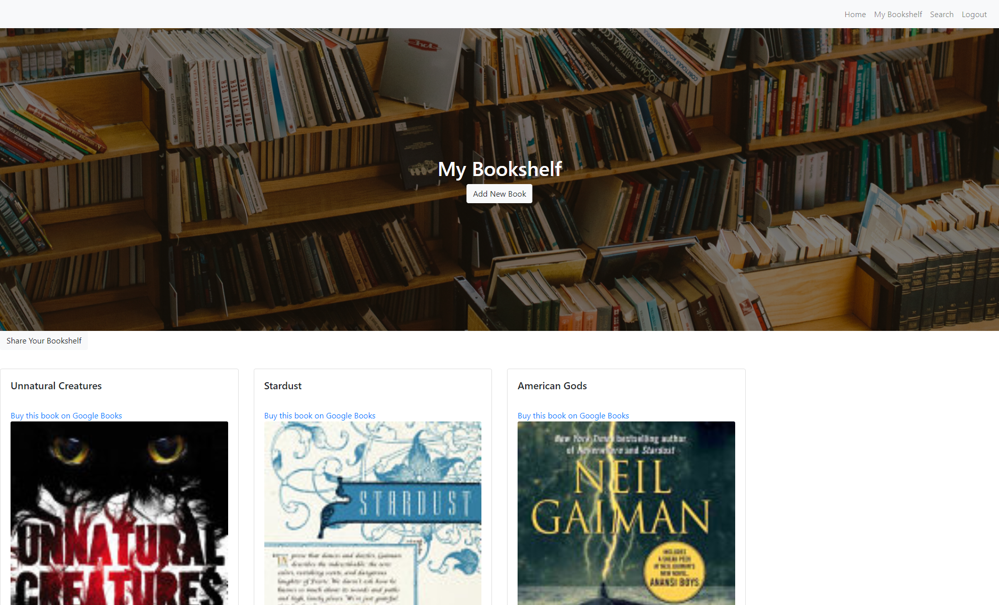

# Project WORM

[](#license) 


* [Pirooz Wallace](https://github.com/attack-theoRy)

[Deployed Heroku App](https://gentle-sands-52914.herokuapp.com/)


## Table of Contents
* [Description](#description)
* [User Story](#user-story)
* [Installation](#installation)
* [Tech](#tech)
* [License](#license)
* [Questions](#Questions)
* [Credits](#Credits)

## Description

WORM is an bookshelf application that allows users to search for books by entering a specific query (Title, Author, Exerpt, etc). The user then submits the query, which calls upon the Google Books API that will return an array of books with the corresponding data of the book that was searched for (Title, Author, Published Date, etc.) The user will be able to see the list of books that relate to the search populate on the page. Users can then save their favorite books to their own personal bookshelf library as well as delete them, view samples of the books if they are available, write their own comments or visit the google books link to buy the book for themselves. Also using the Google Books API there is an embedded sample reader button that shows if one is available for that particular book. Clicking on the icon will allow you to read a pre-selected portion of the book within the app.



## User Story

The client is able to create their own account and sign into it using authentication and a hashed password. 

The client is represented as a user who likes to read and likes to keep track of their favorite books. The client can use WORM's book search to find books they would like to read or keep track of.

Books that meet the user's search criteria will be displayed upon search.

Users can add books to their personal bookshelf library, which will be displayed in a separate page of the navigation bar. 

## Installation

To use WORM properly you need to install Node.js. In the terminal, run the following command: 

``` 
npm init -y 
```

Then, install the following dependencies:
```
npm install express to install express
npm install express-handlebars to install handlebars
npm install mysql to install mysql
npm install dotenv for the environment variable
npm install passport for authentication
npm install bcryptjs for authentication / password hashing
npm install sequelize for the sequelize databases
```

## Tech

* HTML
* CSS
* Handlebars
* NodeJS
* Express 
* MySQL 
* Sequelize
* Passport
* Bootstrap
* JQuery
* Heroku
* Jaws_DB addon for Heroku
* [Google Books API](https://developers.google.com/books)
* [NodeMailer](https://nodemailer.com/usage/)  -- feature not complete, not included in code


## Questions

Email: PiroozWallace@outlook.com
or visit my portfolio at: GitHub Pages: https://attack-theory.github.io/Portfolio/

## Credits

WORM was created by team members from UC Davis's Part-Time Full Stack Coding Bootcamp: 

* [Pirooz Wallace](https://github.com/attack-theoRy)
* [Mike Derjabin](https://github.com/mikederjabin)
* [Alex Bachicha](https://github.com/alexbachicha)
* [Eli Derjabin](https://github.com/derjabineli)

## License 

Licensed under the [MIT License](LICENSE.txt)
